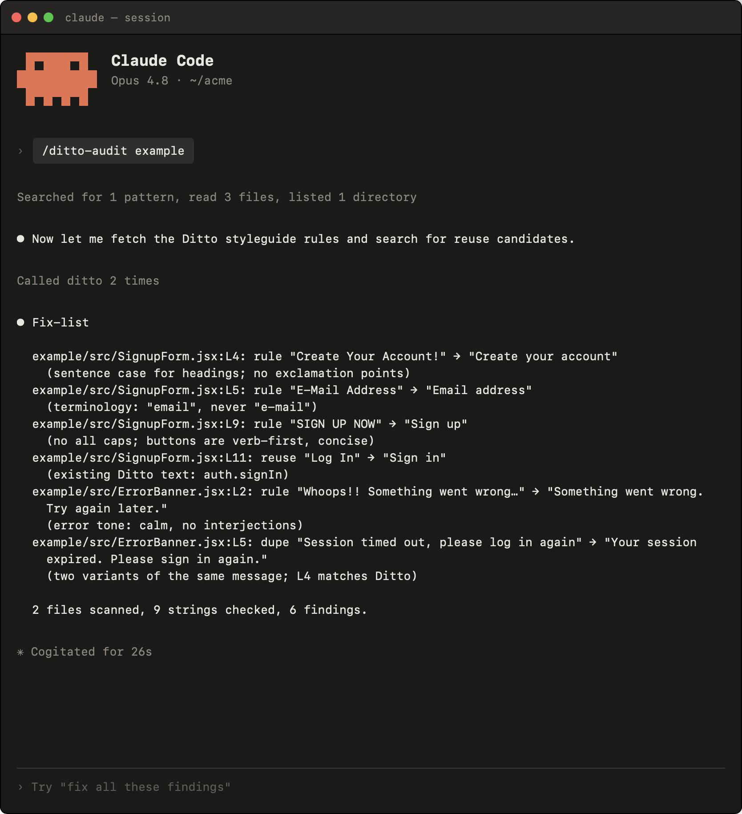
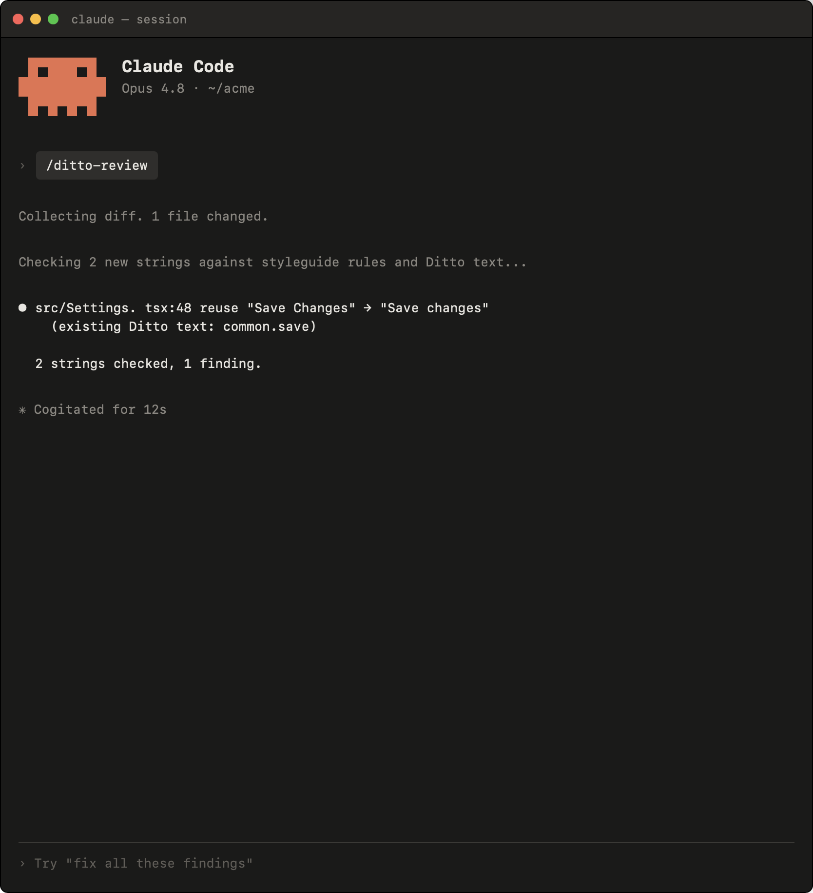

# Ditto Agent Setup Package

Ditto's bundled agent integration:

- [Ditto MCP server](https://developer.dittowords.com/mcp-reference/overview)
- Session hooks: every session starts with instructions to consult Ditto for user-facing copy,
  without you prompting it.
- `/ditto-review`: check the current diff's user-facing strings against your
  styleguide rules and existing Ditto text; returns a fix-list.
- `/ditto-audit [path]`: check the path for user-facing strings against your
  styleguide rules and existing Ditto text; returns a fix-list.
- `/ditto-spec-audit [component]`: (for repos using Ditto specs) audit every
  instance of a specced component across the codebase against its spec's
  rules.
- `/ditto-spec-component <component>`: (for repos using Ditto specs) analyze a component, create or update
  its Ditto spec file (and specs for child components that lack one), and sync
  styleguide rules from the platform.
- `/ditto-spec-gaps [component]`: (for repos using Ditto specs) find copy patterns across component
  instances that should be styleguide rules but aren't; create approved ones
  on the platform.

The `/ditto-spec-audit`, `/ditto-spec-component`, and `/ditto-spec-gaps` skills
work on repos set up for Ditto Specs. See the [agent skills
reference](https://developer.dittowords.com/ditto-specs-cli-reference/agent-skills)
for the full explanation of each.

## Install

Grab your API token from [your Ditto account
settings](https://app.dittowords.com/account/user).

Set it once in the shell your agent runs in — Claude Code, Codex, OpenCode, and
Gemini CLI all read the token from this environment variable:

```bash
export DITTO_API_TOKEN=<your-api-token>
```

Add that line to your shell profile (`~/.zshrc`, `~/.bashrc`) so it persists
across sessions. GitHub Copilot CLI is the exception — it can't read env vars
in its MCP config, so paste the token directly there (shown below).

Then register the Ditto MCP for your host.

### Claude Code

```
/plugin marketplace add dittowords/ditto-agent-setup
/plugin install ditto@ditto
```

Restart Claude Code (or run `/mcp`) and approve the `ditto` MCP server.

### Codex

```bash
codex plugin marketplace add dittowords/ditto-agent-setup
codex plugin add ditto@ditto
```

Run `codex`, open `/hooks`, and trust the session hooks. The plugin reuses
`skills/` and the session instructions from `hooks/hooks.json`.

Register the Ditto MCP in `~/.codex/config.toml`:

```toml
[mcp_servers.ditto]
command = "npx"
args = ["-y", "mcp-remote", "https://api.dittowords.com/v2/mcp", "--header", "Authorization: token ${DITTO_API_TOKEN}"]
```

### GitHub Copilot CLI

```bash
copilot plugin marketplace add dittowords/ditto-agent-setup
copilot plugin install ditto@ditto
```

Commands are namespaced by plugin name, e.g. `/ditto:ditto-review`.

Register the Ditto MCP in `~/.copilot/mcp-config.json`. Copilot can't expand
env vars here, so paste your token in place of `<your-api-token>`:

```json
{
  "mcpServers": {
    "ditto": {
      "type": "http",
      "url": "https://api.dittowords.com/v2/mcp",
      "headers": {
        "Authorization": "token <your-api-token>"
      }
    }
  }
}
```

Without the plugin, Copilot still picks up the instructions from `AGENTS.md`
or `.github/copilot-instructions.md` in a repo, or globally from
`~/.copilot/copilot-instructions.md` (instructions only, no commands or
skills).

### OpenCode

Add to your `opencode.json`, pointing at a checkout of this repo:

```json
{
  "plugin": ["<path-to-checkout>/.opencode/plugins/ditto.mjs"],
  "mcp": {
    "ditto": {
      "type": "remote",
      "url": "https://api.dittowords.com/v2/mcp",
      "headers": {
        "Authorization": "token {env:DITTO_API_TOKEN}"
      }
    }
  }
}
```

The plugin injects the Ditto instructions every turn and registers the
`/ditto-*` commands and bundled skills.

### Gemini CLI

```bash
gemini extensions install https://github.com/dittowords/ditto-agent-setup
```

The extension loads `AGENTS.md` as always-on context, registers the
`/ditto-*` commands and skills, and configures the Ditto MCP server (reads
`DITTO_API_TOKEN` from your environment). If the MCP server fails to
authenticate, add it manually:

```bash
gemini mcp add --transport http ditto https://api.dittowords.com/v2/mcp --header "Authorization: token <your-api-token>"
```

### Optional: set up Ditto Specs

[Ditto Specs](https://developer.dittowords.com/ditto-specs-cli-reference/overview)
are `*.ditto.md` files that co-locate copy rules with your components. Run
`/ditto-spec-setup` where commands are supported, or ask the agent to run the
ditto-spec-setup skill. The setup asks before doing anything, installs the
specs CLI only if missing, creates `dittospec.config.json` and
`workspace.ditto.md`, and scaffolds component spec files.

With specs in place `/ditto-spec-audit`, `/ditto-spec-component`, and `/ditto-spec-gaps` become usable.

### Keeping instruction copies aligned

`AGENTS.md` and `.github/copilot-instructions.md` are copies of
`hooks/ditto-instructions.md` for instruction-tier hosts. When changing
instruction text, edit `hooks/ditto-instructions.md` and copy it to both.

## Try it on the example

The [`example/`](example) directory contains sample components seeded with
copy problems (inconsistent casing, "Log in" vs "sign in", shouty errors).
From this repo:



And `/ditto-review` does the same for just your working diff, useful right
before a commit:



